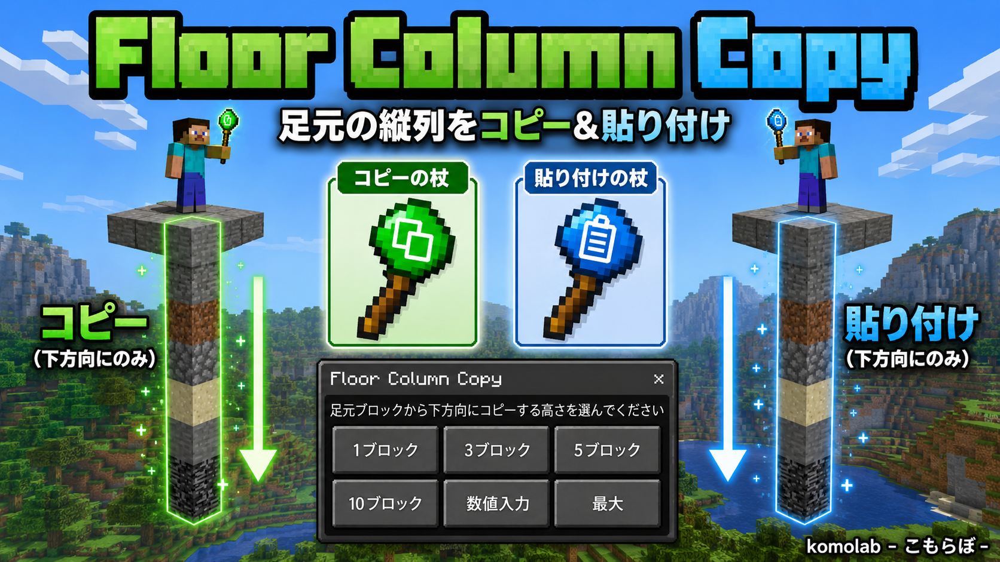
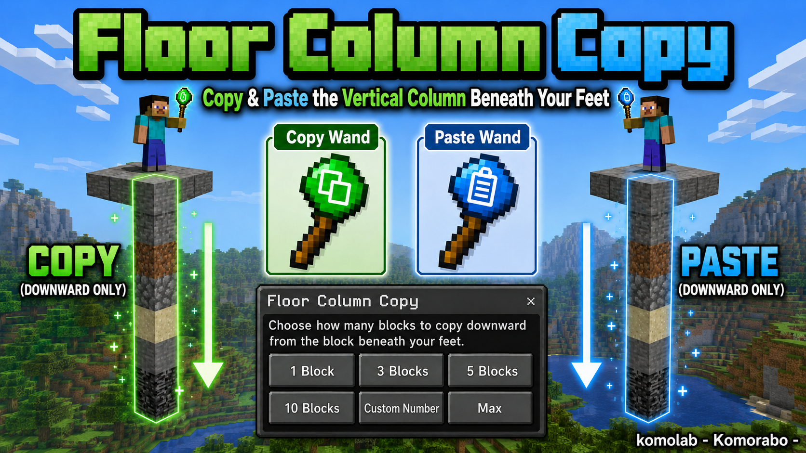

# アドオン説明文（配布・紹介用）

**制作:** komolab - こもらぼ -

---

## 説明画像

| 言語 | ファイル |
| --- | --- |
| 日本語 | [description_ja.png](./images/description_ja.png) |
| English | [description_en.png](./images/description_en.png) |

### 日本語



### English



---

## 短い説明（1〜2 行）

### 日本語

足元ブロックから**下方向だけ**にブロック列をコピーし、別の場所へ貼り付ける統合版向け建築支援アドオン。

### English

A Bedrock Edition building utility that copies a vertical column of blocks **downward only** from beneath your feet and pastes it elsewhere.

---

## 配布サイト向け（中程度）

### 日本語

#### Floor Column Copy

コピーの杖で高さを選び、貼り付けの杖で即復元。クリエイティブ建築や地形複製のショートカットに。

- **対応環境:** Minecraft 統合版（Bedrock）1.21 以降
- **操作:** コピーの杖 / 貼り付けの杖（Beta APIs 不要）
- **言語:** ゲーム言語が日本語なら日本語、それ以外は英語
- **補助:** `/fc:give` `/function fc/give` クリエイティブアイテムタブ

制作: **komolab - こもらぼ -**

### English

#### Floor Column Copy

Select a height with the Copy Wand, then restore the column instantly with the Paste Wand. A shortcut for creative building and terrain duplication.

- **Platform:** Minecraft Bedrock Edition 1.21+
- **Controls:** Copy Wand / Paste Wand (no Beta APIs required)
- **Language:** Japanese when the game language is Japanese; English otherwise
- **Extras:** `/fc:give`, `/function fc/give`, Creative inventory

By **komolab - Komorabo -**

---

## タグ・キーワード案

```txt
Minecraft, Bedrock, 統合版, アドオン, 建築, コピー, 貼り付け, copy, paste,
creative, building, wand, column, クリエイティブ
```

---

## BOOTH 販売ファイル

作品ファイルには次をアップロードしてください。

```bash
npm run pack:mcaddon
```

| ファイル | 用途 |
| --- | --- |
| `dist/FloorColumnCopy_v*.zip` | **BOOTH 作品ファイル（zip のみ可の場合）** |
| `dist/FloorColumnCopy_v*.mcaddon` | 同内容（.mcaddon が上げられる場合） |
| `dist/README_BUYER.txt` | 購入者向け導入手順 |
| `docs/images/description_ja.png` | 日本語の紹介画像（サムネイル推奨） |
| `docs/images/description_en.png` | 英語の紹介画像 |

**BOOTH 商品名・紹介文・タグのコピペ用:** [booth-listing.md](./booth-listing.md)

購入者は ZIP を `.mcaddon` にリネームしてダブルクリック、または展開して `floor_column_copy_bp` / `floor_column_copy_rp` を配置 → ワールドでビヘイビア＋リソース両方を有効化します。
